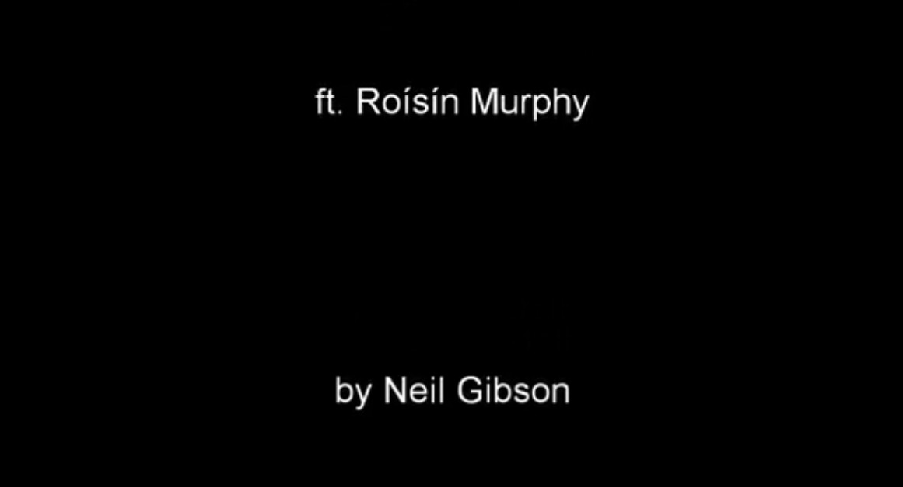
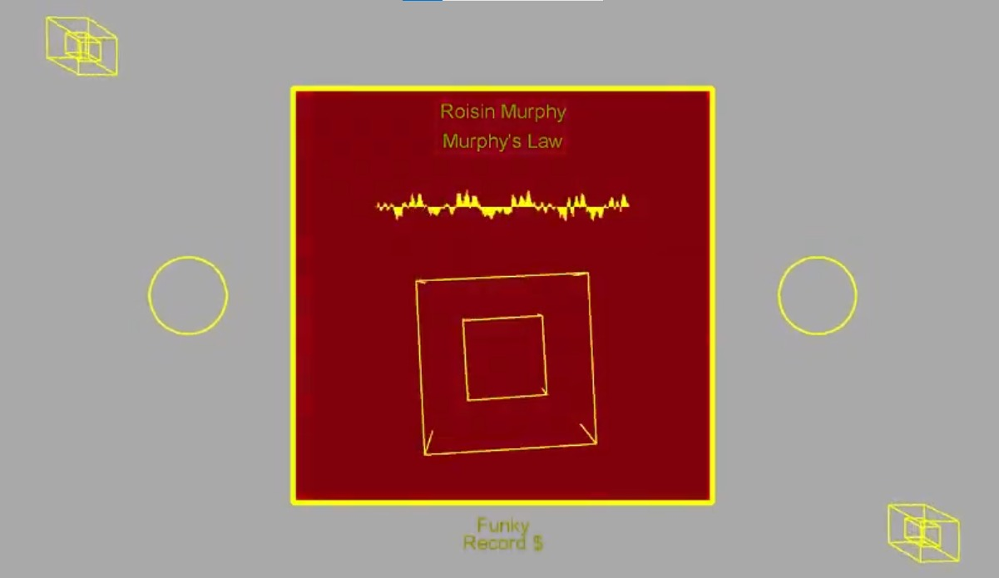
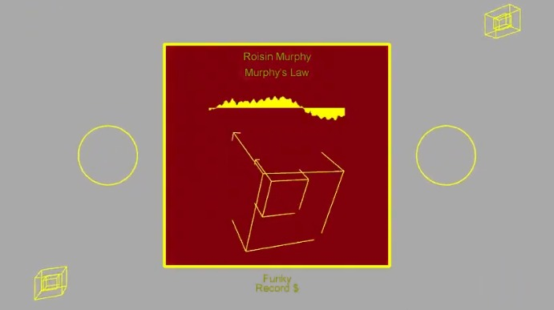
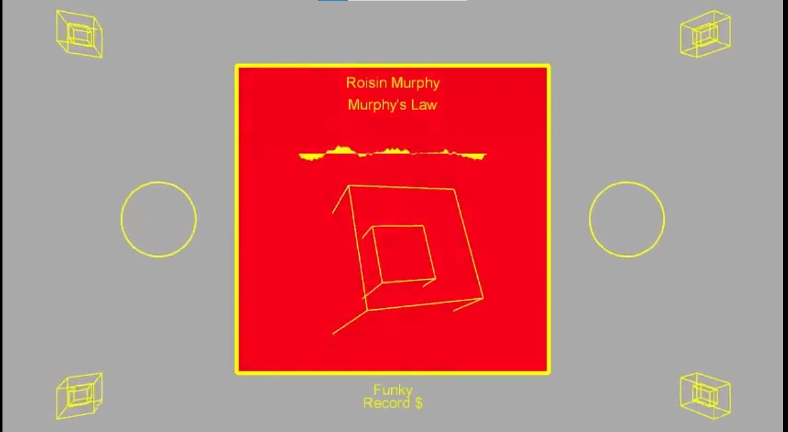
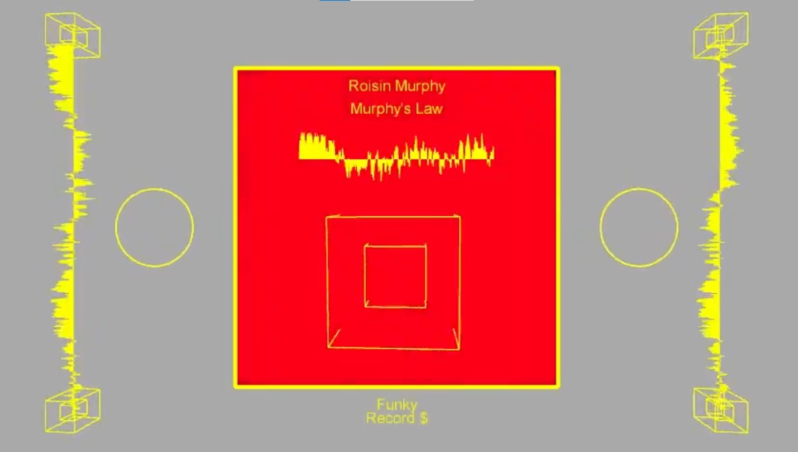
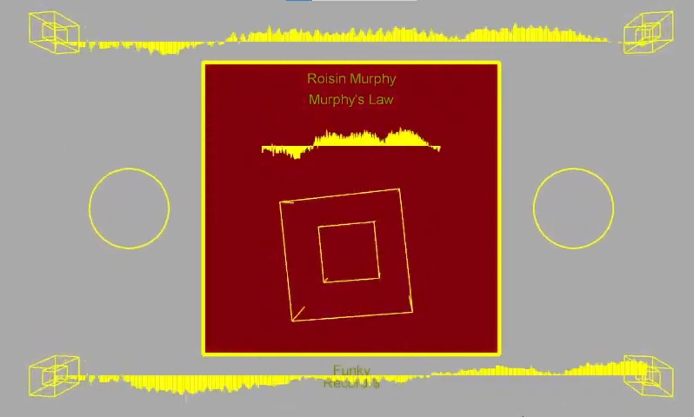

# Music Visualiser Project

Name: Neil Gibson

Student Number: C17438292

## Instructions
- Fork this repository and use it a starter project for your assignment
- Create a new package named your student number and put all your code in this package.
- You should start by creating a subclass of ie.tudublin.Visual
- There is an example visualiser called MyVisual in the example package
- Check out the WaveForm and AudioBandsVisual for examples of how to call the Processing functions from other classes that are not subclasses of PApplet

# Description of the assignment
This assignment is a cool, funky visual representation of a song by Roisin Murphy called Murphys Law.
It reacts to the sound of the music in multiple ways throughout the  song including the colours of some items, and the size of some items. As it is a funky song I decided to choose vibrant colours throughout and base my design around disco and disco themes. It will start with an intro that renders automatically with the song, introducing me and the song name and artist. Then moving to a disco ball for a few moments to set the scene of the song until the song ups the tempo. After this it will cut to a vinyl record and this is where the audio visuals begin. This will be the main screen throughout now and as the song continues I incremently add more features to the screen that react to the sound until finally finishing with a small reactive outro. It is controlled using the spacebar and the numbers 1 to 8.

# Instructions
1.  This is the intro and it loads automatically on the first render along with the music. *Keep it playing untill enjoy sits in the middle of the screen and the music starts to pick up.* 
1.  This is the disco ball that should spin for approx 30 seconds again until a key change in the music, its purpose is to set the discoey scene for the rest of the visual. You access this by hitting the spacebar. 
1.  This the first iteration of the vinyl record and should be pressed after the first key change in the song. Accessed by pressing the number '1' key. 
1.  This is the second iteration of the vinyl which spawns 2 cubes on the top left and bottom right of the screen. This will be swapped back and forth with the next feature to create some nice visuals. This can be accessed buy hitting the '2' key. 
1. This is the 3rd iteration and as mentioned befor will be swapped back and forth with the previous feature to create nice visuals to go along with the music. This spawns 2 cubes on the top right and bottom left of the screen. This feature can be accessed by hitting the number '3' key. 
1.  This is the 4th iteration of the vinyl and should appear around the time of the first hook.  This can be accessed by pressing the number '4' key and will join the previous 2 features and spawn all 4 cubes on each corner of the screen at the same time. 
1.  This is the fifth iteration which will begin to tease sine waves connecting the cubes from top to bottom and again similarly will be rotated out with the next feature back and forth until the next major key change/chorus. Accessed by pressing the number '5' key. 
1.  This is the sixth iteration of the vinyl, teasing sine waves connecting cubes from left to right and should be swapped back and forth with the previous feature along with the beat until the next hook/chorus. Accessed by pressing the number '6' key. 
1.  This is the final form of the vinyl and will combine every feature up until now. Every feature before this has beenleading up to this stage and can be accessed by pressing the '7' key. 
1.  Finally as the music fizzles out there will be a small outro with rotating cubes that grow and shrink with the sound of the music and a thank you note. This can be accessed by pressing the number '8' key. *!!!This should only be pressed last as it changes the angle of the screens camera to view these rotating audio bands!!!* 

# How it works

# What I am most proud of in the assignment
I am most proud of my use of constructor chaining and general understanding and implementation of OOP concepts throughout this project which at at the start of the semester I definitely would not have had a clue. Particularly the constructor for the vinyl record class which calls the cube classes constructor to create a nice visual.
```Java
    public Vinyl(NeilsVisual nv, float howMany)
    {
        this.nv = nv;
        this.howMany = howMany;
        this.halfh = (float) this.nv.height/2;
        this.halfw = (float) this.nv.width/2;
        this.frX = (float) this.nv.width/2;
        this.frY = (float) this.nv.width/2;
        by1 = nv.height*0.9f;
        bx1 = nv.width*0.9f;
        bx = nv.width*0.1f;
        by = nv.height*0.08f;
        by2 = nv.height*0.08f;
        bx2 = nv.width*0.9f;
        bx3 = nv.width*0.1f;
        by3 = nv.height*0.9f;


    //  chain a constructor to create a cube when Vinyl is created. passing reference to NV, x & y co-ord, and height.
        this.c = new Cube(this.nv, this.halfw, (this.halfh) + 75, (float)(this.nv.height*0.25), true);
        this.b = new Cube(this.nv, this.bx, by, 50, false);
        this.b1 = new Cube(this.nv, this.bx1, by1, 50, false);
        this.b2 = new Cube(this.nv, this.bx2, by2, 50, false);
        this.b3 = new Cube(this.nv, this.bx3, by3, 50, false);

    }
```
I am also really proud of the sine wave class I made which maps the 2 x and y co-ordinates passed and determines whether or not the sine wave will be displayed horizontally or vertically based on the values which i thought was pretty cool. It also fits really well with the music!

# Markdown Tutorial

This is *emphasis*

This is a bulleted list

- Item
- Item

This is a numbered list

1. Item
1. Item

This is a [hyperlink](http://bryanduggan.org)

# Headings
## Headings
#### Headings
##### Headings

This is code:

```Java
public void render()
{
	ui.noFill();
	ui.stroke(255);
	ui.rect(x, y, width, height);
	ui.textAlign(PApplet.CENTER, PApplet.CENTER);
	ui.text(text, x + width * 0.5f, y + height * 0.5f);
}
```

So is this without specifying the language:

```
public void render()
{
	ui.noFill();
	ui.stroke(255);
	ui.rect(x, y, width, height);
	ui.textAlign(PApplet.CENTER, PApplet.CENTER);
	ui.text(text, x + width * 0.5f, y + height * 0.5f);
}
```

This is an image using a relative URL:


This is an image using an absolute URL:


This is a youtube video:

[](https://www.youtube.com/watch?v=J2kHSSFA4NU)

This is a table:

| Heading 1 | Heading 2 |
|-----------|-----------|
|Some stuff | Some more stuff in this column |
|Some stuff | Some more stuff in this column |
|Some stuff | Some more stuff in this column |
|Some stuff | Some more stuff in this column |

